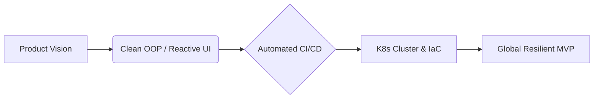

# ⚡ Jorge Requena R. | Senior Full-Stack Architect & DevOps Lead

  

  

> **"There are no impossible tasks, only architectures waiting to be optimized."**
> A versatile Software Engineer specialized in bridging the gap between rapid MVP development and robust, high-availability cloud infrastructure.

---

### 🚀 The Engineering Life Cycle (Idea to Global Scale)

My workflow integrates advanced development paradigms with elastic infrastructure as code from day one.

---

### 🔥 Core Strengths & Tech Ecosystem

| 🏗️ Infra & DevOps | 🧠 Backend & Logic | 📱 Frontend & Mobile |
| :--- | :--- | :--- |
| **Kubernetes & IaC:** Expert in container orchestration (K8s) and Infrastructure as Code (Terraform). | **Python (Django) & Java (Spring):** Building enterprise-grade, scalable monolithic and microservice backends. | **ReactJS & AngularJS:** Crafting complex, high-performance Single Page Applications. |
| **CI/CD Excellence:** Designing friction-free pipelines for high-frequency, reliable releases. | **Multi-Stack PHP Specialist:** Mastery of Laravel, CakePHP, and CodeIgniter frameworks. | **Flutter & React Native:** Delivering seamless, native-feeling cross-platform mobile experiences. |
| **DevOps Culture:** Deep focus on automation, observability, security, and system resilience. | **Ruby on Rails:** Rapid prototyping and agile backend development for startups. | **PWA & Advanced JS:** Progressive Web Apps utilizing advanced Object-Oriented paradigms. |

---

### 🛠️ Specialized Technical Arsenal

- **Systems Programming:** High-performance desktop applications with **C++ (Qt Framework)**.
- **Legacy & Native Mastery:** Deep expertise in **Objective-C** for specialized Apple environments.
- **Real-time Ecosystems:** Scalable data synchronization and backend-as-a-service with **Firebase & Firestore**.
- **Startup Accelerator:** Specialized in engineering services for **MVPs and Startups**. I operate under the principle that learning new technologies is a mandatory evolution for software engineers.

---

### 📈 GitHub Impact & Performance

 

  

---

### 🤝 Let's Build Something Great
I am always open to discussing complex architectures, high-performance systems, or the next big startup challenge.

 
---

  

